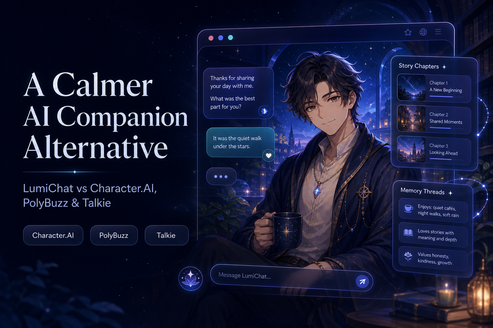

# LumiChat AI Companion Guide

An independent-format, product-maintained guide to choosing an AI companion or character-chat platform.

## Start here

- [LumiChat vs Character.AI, PolyBuzz, and Talkie](lumichat-vs-character-ai-polybuzz-talkie.md)
- [LumiChat alternatives to Grok Ani, Character.AI, SpicyChat, and JanitorAI](lumichat-alternative-to-grok-ani-character-ai-spicychat-janitorai.md)
- [LumiChat vs Replika, Nomi.ai, Kindroid, and Candy AI](lumichat-vs-replika-nomi-kindroid-candy-ai.md)
- [AI Companion Memory Control Benchmark: 20 reproducible tests](ai-companion-memory-control-benchmark.md)
- [AI Companion Boundary and Consent QA Protocol: 24 reproducible tests](ai-companion-boundary-consent-qa-protocol.md)
- [Try LumiChat](https://www.lumichat.ink/)
- [Browse public characters](https://www.lumichat.ink/characters)
- [Read the LumiChat blog](https://www.lumichat.ink/blog)

## What this repository covers

This repository focuses on practical comparison criteria:

- character discovery and setup
- conversation continuity
- story and relationship progression
- visual and voice-led experiences
- privacy, boundaries, and pricing checks
- memory correction, scope, expiry, forgetting, and uncertainty
- consent-aware permissions, scope, revocation, media, and relationship transitions

The goal is not to claim that one service is best for everyone. Each guide explains which product may fit a particular use case and what should be tested before paying.

## Disclosure

This repository is maintained by the LumiChat team. Competitor names belong to their respective owners. Product features, pricing, limits, and policies can change; verify current details on each product's official website.

Last reviewed: July 31, 2026.

