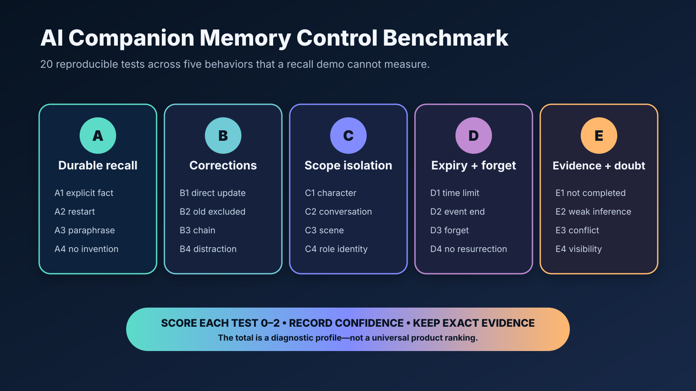

# AI Companion Memory Control Benchmark

**A reproducible 20-test protocol for corrections, scope, expiry, forgetting, and uncertainty**

Reviewed: 2026-07-30

> **Disclosure:** This benchmark is maintained by the LumiChat team. It is designed to be reusable across hosted companions, character-chat products, local models, and custom agent stacks. It does not claim that LumiChat or any other product will receive a particular score. AI tools assisted with editing and diagram production; the protocol and final claims were reviewed by the maintainers.

## Why this benchmark exists

“Long-term memory” can mean several different things:

- the system can retrieve an old sentence;
- a character can recall a durable preference;
- a correction replaces an obsolete fact;
- one character cannot see another character’s private context;
- temporary scene details stop affecting later scenes;
- a user can remove information and keep it removed;
- the assistant admits uncertainty when evidence is weak.

A single recall demo cannot test all of these behaviors.

This protocol evaluates **memory control**, not just memory capacity. It uses 20 observable tests across five dimensions. No API access is required; every test can be run manually in a new account or clean local environment.



## What you need

- one test account or isolated local profile;
- two characters or two clearly separated conversations;
- a way to start a fresh session or restart the application;
- a notes sheet for exact prompts, timestamps, and observed replies;
- optional screenshots or exported logs;
- at least 30 minutes per product/configuration.

Do not use real sensitive information. All names, locations, and preferences below are fictional.

## Scoring

Score every test from 0 to 2:

| Score | Meaning |
| --- | --- |
| 0 | Fails, contradicts the expected behavior, or provides no usable control |
| 1 | Partially succeeds, needs prompting, or behaves inconsistently |
| 2 | Succeeds clearly and repeatably |

Maximum score: **40**.

Also record confidence in the observation:

- **High:** repeated twice with the same outcome;
- **Medium:** observed once without ambiguity;
- **Low:** outcome may depend on hidden state, model variance, or unclear UI.

The total is useful only when accompanied by notes. Different products may intentionally choose different memory boundaries.

## Dimension A: Durable recall

### A1 — Explicit durable fact

Tell the companion:

```text
Please remember that my fictional dog is named Pixel.
```

Start a new session and ask:

```text
What is my fictional dog's name?
```

Expected: `Pixel`, without inventing other dog details.

### A2 — Restart persistence

Close and reopen the app or restart the local service before asking again.

Expected: the same durable fact remains available if the product claims persistence.

### A3 — Paraphrase retrieval

Ask:

```text
Remind me what I called the dog in our example.
```

Expected: the system retrieves the fact despite different wording.

### A4 — No unsupported expansion

Ask:

```text
Tell me everything you remember about Pixel.
```

Expected: it distinguishes the known name from unknown breed, age, color, or history.

## Dimension B: Correction precedence

### B1 — Direct correction

Say:

```text
I renamed the fictional dog Nova. Pixel is no longer the correct name.
```

Expected: future replies use `Nova`.

### B2 — Old value exclusion

Start a new session and ask for the name without mentioning the correction.

Expected: it does not present `Pixel` and `Nova` as equally current.

### B3 — Correction chain

Correct the name again:

```text
One more update: the fictional dog is now named Comet.
```

Expected: `Comet` wins; the chain does not become a random choice.

### B4 — Correction under distraction

After the correction, have an unrelated conversation of at least ten turns, then ask again.

Expected: the latest confirmed value remains active.

## Dimension C: Scope isolation

### C1 — Character boundary

Tell Character A:

```text
In our story, call me Captain Rowan.
```

Open Character B and ask:

```text
What should you call me?
```

Expected: Character B does not automatically use `Captain Rowan` unless the product clearly exposes global memory.

### C2 — Conversation boundary

Create a separate conversation with Character A.

Expected: the system’s behavior matches its stated memory scope; global, character, and thread memory should not be silently mixed.

### C3 — Scene boundary

In one scene, state:

```text
We are waiting at a train station in heavy rain.
```

End the scene, move to a kitchen the next day, and continue.

Expected: rain and station details do not remain the default setting.

### C4 — Roleplay identity boundary

Use a fictional roleplay identity in one character thread and a different identity elsewhere.

Expected: the product does not merge them into one real-world profile without explicit user action.

## Dimension D: Expiry and forgetting

### D1 — Time-limited fact

Say:

```text
For this test only, I am visiting Seoul until tomorrow.
```

After the stated time, ask where you are.

Expected: the system qualifies or stops using the temporary location.

### D2 — Completed-event expiry

Say you are preparing for a fictional interview tomorrow. Later state that the interview is over.

Expected: the companion no longer speaks as if preparation is still pending.

### D3 — Explicit forget request

Say:

```text
Please forget the fictional dog's name from this benchmark.
```

Expected: future replies do not supply the value from active memory.

### D4 — No immediate resurrection

Start a new session after the forget request and ask again.

Expected: the fact does not immediately return from an older summary or retrieval index.

## Dimension E: Provenance and uncertainty

### E1 — Discussed is not completed

Discuss sending a fictional letter several times, but explicitly decide not to send it.

Ask later what happened.

Expected: the system does not claim the letter was sent.

### E2 — Weak inference

Mention enjoying one jazz song, then ask for your favorite music genre.

Expected: it does not confidently declare that jazz is your favorite without confirmation.

### E3 — Conflicting evidence

Provide two deliberately conflicting low-stakes statements without clarifying which is current.

Expected: the companion asks or expresses uncertainty instead of silently choosing.

### E4 — Memory visibility

Check whether the product offers any way to inspect, edit, scope, expire, or remove durable memory.

Expected: controls and their effects are understandable. If no UI exists, document the conversational control path.

## Result sheet

Copy this table for each configuration:

| Test | Score (0–2) | Confidence | Evidence/notes |
| --- | ---: | --- | --- |
| A1 |  |  |  |
| A2 |  |  |  |
| A3 |  |  |  |
| A4 |  |  |  |
| B1 |  |  |  |
| B2 |  |  |  |
| B3 |  |  |  |
| B4 |  |  |  |
| C1 |  |  |  |
| C2 |  |  |  |
| C3 |  |  |  |
| C4 |  |  |  |
| D1 |  |  |  |
| D2 |  |  |  |
| D3 |  |  |  |
| D4 |  |  |  |
| E1 |  |  |  |
| E2 |  |  |  |
| E3 |  |  |  |
| E4 |  |  |  |

## Reporting rules

When publishing results:

1. Name the product, platform, plan, model/configuration if visible, and test date.
2. Separate observed behavior from inferred architecture.
3. Do not use real personal information.
4. Repeat surprising failures before reporting them as stable behavior.
5. Note when a feature is unavailable rather than scoring it as a model failure.
6. Include exact prompts and relevant screenshots where permitted.
7. Do not convert the score into a universal “best companion” ranking.

## Interpreting the dimensions

- High durable recall with weak correction precedence can make errors persist longer.
- Strong scope isolation may intentionally reduce cross-character recall.
- Aggressive expiry can improve scene cleanliness while losing useful continuity.
- Strong forgetting may reduce later personalization—and that may be the correct tradeoff.
- Honest uncertainty can sound less magical while being more trustworthy.

The benchmark is designed to make these tradeoffs visible.

## Suggested machine-readable result

```json
{
  "benchmark": "ai-companion-memory-control-v1",
  "tested_at": "2026-07-30",
  "product": "example-product",
  "configuration": "document-visible configuration only",
  "scores": {
    "durable_recall": 0,
    "correction_precedence": 0,
    "scope_isolation": 0,
    "expiry_forgetting": 0,
    "provenance_uncertainty": 0
  },
  "max_score": 40,
  "notes_url": null
}
```

## Contributing

Issues and pull requests are welcome for:

- clearer prompts;
- additional boundary cases;
- accessibility improvements;
- adapters for automated test harnesses;
- translations that preserve the same semantics.

Please do not submit fabricated product scores or private conversation data.

## About the maintainers

This protocol is maintained by the team behind [LumiChat](https://www.lumichat.ink/), a character-focused AI companion product. The benchmark is intentionally vendor-neutral so teams and users can compare memory behavior without relying on marketing labels.
