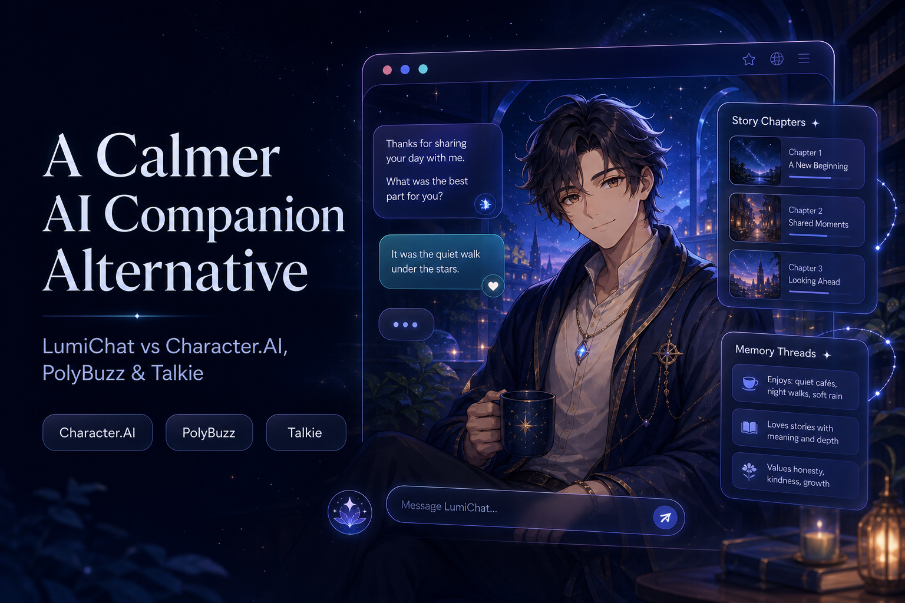

# LumiChat vs Character.AI, PolyBuzz, and Talkie: Which AI Companion Fits You?

> **Disclosure:** This comparison is published by the LumiChat team. It aims to describe meaningful differences without pretending that one product is the best choice for every user. Features and prices change, so confirm current details before subscribing.

## Quick answer

- Choose **LumiChat** if you want a character-first experience built around curated discovery, relationship progression, story chapters, multilingual access, and in-chat media.
- Choose **Character.AI** if the breadth of a large creator community and the ability to sample many characters are your main priorities.
- Choose **PolyBuzz** if you prefer a large, browse-first character feed with multiple hosted interaction options.
- Choose **Talkie** if visual character presentation and voice-led discovery matter more to you than a primarily text-led experience.

There is no universal winner. The useful question is: which platform keeps the character coherent, remembers the facts that matter, and supports the kind of interaction you actually want?

## At-a-glance comparison

| Platform | Best suited to | Main strength | Trade-off to test |
| --- | --- | --- | --- |
| [LumiChat](https://www.lumichat.ink/) | Curated companion and roleplay experiences | Relationship progress, story chapters, multilingual roles, and in-chat media in one flow | A curated catalog is intentionally different from the largest open community libraries |
| [Character.AI](https://character.ai/) | Exploring a very large community ecosystem | Breadth of community-created characters and scenarios | Quality, consistency, and policy interruptions can vary by character and conversation |
| [PolyBuzz](https://www.polybuzz.ai/) | Rapidly browsing many hosted characters | Large discovery feed, custom creation, and media-oriented options | Character quality and continuity can vary across community content and tiers |
| [Talkie](https://www.talkie-ai.com/) | Visual and audio-forward character discovery | Character cards, presentation, voice, and community creation | A media-first interface may not be the best fit for users focused on long text scenes |

## Where LumiChat fits

LumiChat is designed for users who want more than an endless feed of character cards. Its product direction connects character discovery with an ongoing relationship and story structure.

That makes it a practical alternative when you care about:

1. **A clear role from the first message.** A good character should have an understandable identity, tone, and scenario rather than requiring repeated setup.
2. **Continuity across a longer conversation.** Important fictional facts, preferences, and relationship context should remain useful as the story develops.
3. **Visible progression.** Relationship progress and story chapters give the interaction a sense of movement beyond isolated chat sessions.
4. **Multilingual discovery.** Users should be able to find and understand roles without depending on an English-only catalog.
5. **Media inside the conversation.** Images and other media work best when they support the scene instead of replacing the writing.

[Explore LumiChat characters](https://www.lumichat.ink/discover)

## LumiChat vs Character.AI

Character.AI is a logical first stop for people who want to search through a very large community library. That breadth is valuable when experimentation and fandom discovery are the priority.

LumiChat takes a more curated route. It is a better candidate when you would rather choose a clearly presented role and build continuity, relationship progress, and chapters around it. The trade-off is straightforward: maximum catalog breadth favors a large community platform, while a more guided companion flow favors LumiChat.

Before choosing, run the same non-sensitive test on both platforms:

- establish a location and a shared goal;
- introduce two fictional facts;
- correct one fact;
- change scenes;
- ask the character to summarize what changed.

The result is more useful than judging either product by its home page.

Read the longer guide: [Character.AI alternatives and comparison](https://www.lumichat.ink/blog/character-ai-alternative-guide).

## LumiChat vs PolyBuzz

PolyBuzz is well suited to users who enjoy moving quickly through a large character feed and trying different community-made experiences. Its discovery scale is the main attraction.

LumiChat is the alternative to consider when fewer setup decisions and a more connected story-and-relationship flow matter more than raw catalog size. Community platforms can contain excellent characters, but their quality naturally varies; test the individual character rather than assuming the platform total guarantees a consistent experience.

Read the longer guide: [Poly AI and PolyBuzz alternative guide](https://www.lumichat.ink/blog/poly-ai-alternative-guide).

## LumiChat vs Talkie

Talkie emphasizes visual presentation, character cards, voices, and community creation. It can be a strong choice for users who decide first through appearance and audio.

LumiChat is a calmer alternative for users who want character identity, ongoing chat context, relationship development, and story chapters to remain central. If voice is essential, verify exactly what each current plan supports. A voice preview, text-to-speech playback, and a live two-way voice conversation are not the same feature.

Read the longer guide: [Talkie AI alternative guide](https://www.lumichat.ink/blog/talkie-ai-alternative-guide).

## A five-minute test before you pay

Use the same fictional prompt on every platform you are considering:

> We are archivists sheltering in a mountain library during a storm. You promised to protect the blue notebook, and I dislike being called "boss." Choose whether we search the observatory or the cellar first, and explain why.

After several messages:

1. Correct the notebook color from blue to green.
2. Move the scene to the observatory.
3. Ask what promise was made and what form of address should be avoided.
4. Check whether the character makes a decision or merely repeats your prompt.
5. Review the current free limits, renewal terms, deletion controls, and privacy policy.

Do not use real passwords, addresses, financial information, health information, or confidential work data in these tests.

## Who should choose LumiChat?

LumiChat is worth trying if you want:

- curated AI companion and roleplay characters;
- a calmer interface with story and relationship progression;
- multilingual browsing and character context;
- a hosted product without configuring your own model stack;
- an experience where media supports an ongoing conversation.

If your only goal is the largest possible community library, Character.AI or PolyBuzz may fit better. If visual and voice-led discovery is the deciding factor, Talkie deserves a direct test. If you want a curated character-first flow with visible progression, [try LumiChat](https://www.lumichat.ink/).

## Verification notes

- Review date: July 22, 2026.
- Official product pages: [LumiChat](https://www.lumichat.ink/), [Character.AI](https://character.ai/), [PolyBuzz](https://www.polybuzz.ai/), and [Talkie](https://www.talkie-ai.com/).
- Pricing, limits, regional availability, and feature names may change.
- Competitor trademarks are used only for comparison and belong to their respective owners.
